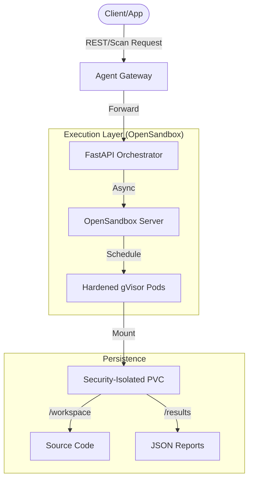
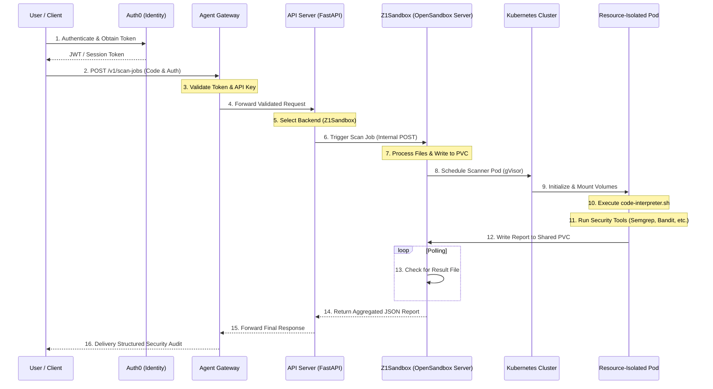

# Z1 Agent Sandbox: The Gold Standard for Secure Code Execution

Welcome to **Z1 Agent Sandbox**, an enterprise-grade, Kubernetes-native platform designed to execute untrusted code in hardened, isolated environments. Whether you are building an AI agent, a CI/CD pipeline, or a multi-tenant cloud application, Z1 Agent Sandbox provides the perfect balance between **Rapid Iteration** and **Strict Security Compliance**.

---

## 🚀 The Vision: Security at the Speed of Development

Z1 Agent Sandbox bridges the gap between high-speed development and rigorous security audits. By combining a **Facade Architecture** with an **Asynchronous execution model**, we allow developers to run code and receive security feedback in milliseconds, not minutes.

### ⚡ The Asynchronous Advantage
Traditional sandbox systems block your API while waiting for infrastructure to provision. Z1 Agent Sandbox eliminates this bottleneck with a "Fire-and-Forget" architecture.

| Metric | Legacy Sync Systems | Z1 Agent Sandbox (Async) |
| :--- | :--- | :--- |
| **Response Latency** | 30 - 60 seconds | **< 100 milliseconds** |
| **Max Concurrent Users** | ~5-10 | **50+ (Scalable)** |
| **API Availability** | Blocks during load | **Non-blocking / Always Responsive** |

---

## 🏗️ Core Architecture: The Facade Pattern

Z1 Agent Sandbox acts as a "Brain" (FastAPI Orchestrator) that manages "Workers" (Sandboxes). This decoupling allows for infinite horizontal scaling and the ability to "hot-swap" backends (Local, Docker, E2B, OpenSandbox) during runtime without a server restart.

### System Blueprint


---

## 🛡️ Security & Identity: A Zero-Trust Model

Identity is verified as close to the compute resource as possible. We use **Asymmetric Cryptography (RS256)** to ensure tokens cannot be forged or tampered with.

### 1. Hardened Authentication (RS256 JWT)
- **Algorithm**: RS256 (RSA-SSA-PKCS1-v1_5 with SHA-256).
- **Validation**: The backend performs native cryptographic validation using Public Keys (JWKS).
- **Integrity**: Tokens include `iss` (Issuer), `aud` (Audience), and `exp` (Expiration) claims to enforce strict access policies.

### 2. Frictionless "Security Bridge"
For browser-based tools like Swagger UI, our **Agent Gateway** implements a CEL-based transformation that bridges the cookie-based world to the header-based world, seamlessly converting session cookies into authenticated bearer headers.

### 3. Kernel-Level Isolation
Powered by **gVisor (runsc)**, Z1 Agent Sandbox provides a second layer of defense. Even if a process escapes the container, it remains trapped within a sandboxed kernel, protecting your host infrastructure.

---

## 🔄 End-to-End System Flow

From ingestion to reporting, every request follows a structured, secure lifecycle.



---

## 🔍 The Automated Security Pipeline

Every sandbox comes pre-equipped with an **Ultra-Strict Security Toolchain** that audits code in real-time.

| Tool | Focus Area | Impact |
| :--- | :--- | :--- |
| **Semgrep** | Logic Auditing | Catches SQL Injection, Command Injection, and Path Traversal. |
| **Gitleaks** | Secret Discovery | Detects hardcoded API keys, tokens, and credentials. |
| **Bandit** | Python Security | Specialized linter for Python security anti-patterns. |
| **Trivy** | Filesystem Safety | Scans for OS vulnerabilities and misconfigured package manifests. |
| **Kube-linter** | K8s Best Practices | Enforces production-readiness standards for manifests. |
| **Kubeconform** | Schema Validation | Validates manifests against official Kubernetes JSON schemas. |
| **Kube-score** | Resiliency Audit | Provides scores/recommendations for K8s object definitions. |

---

## 💻 Developer Experience

### Quick Integration (Python)
Integrate Z1 Agent Sandbox into your workflow with just a few lines of code:

```python
import requests
import time

BASE_URL = "https://your-api-gateway.com/api/z1sandbox"
HEADERS = {"Authorization": "Bearer YOUR_API_TOKEN"}

# 1. Submit the scan job (Instant response)
response = requests.post(f"{BASE_URL}/v1/scan-jobs", json={"code": "print('hello')"}, headers=HEADERS)
job_id = response.json().get("job_id")

# 2. Poll for the consolidated security report
while True:
    report_res = requests.get(f"{BASE_URL}/v1/scan-jobs/{job_id}/report", headers=HEADERS)
    if report_res.status_code == 200:
        print(report_res.json()) # Structured JSON security audit
        break
    time.sleep(2)
```

### Interactive Exploration
Access our auto-generated, interactive **Swagger UI** to test endpoints directly from your browser:
- **Public API Docs**: `https://your-api-gateway.com/api/z1sandbox/docs`

---

## 🚀 Enterprise Deployment

Deploy the entire Z1 Agent Sandbox stack into your Kubernetes cluster using our official **Helm Chart**.

```bash
# Install the system in seconds
helm install z1-agent-sandbox ./charts/z1AgentSandbox
```

### Production Readiness
- **ISO 27001 & SOC 2 Ready**: Designed with strict audit logging and data isolation.
- **High Concurrency**: Proven to handle 50+ concurrent users through non-blocking I/O.
- **Resource Optimized**: Precise CPU/Memory limits and HPA for cost-effective scaling.

---

> [!IMPORTANT]
> **Z1 Agent Sandbox** is more than just a sandbox; it is a **fully managed security pipeline** that protects your infrastructure while empowering your developers to innovate faster.
